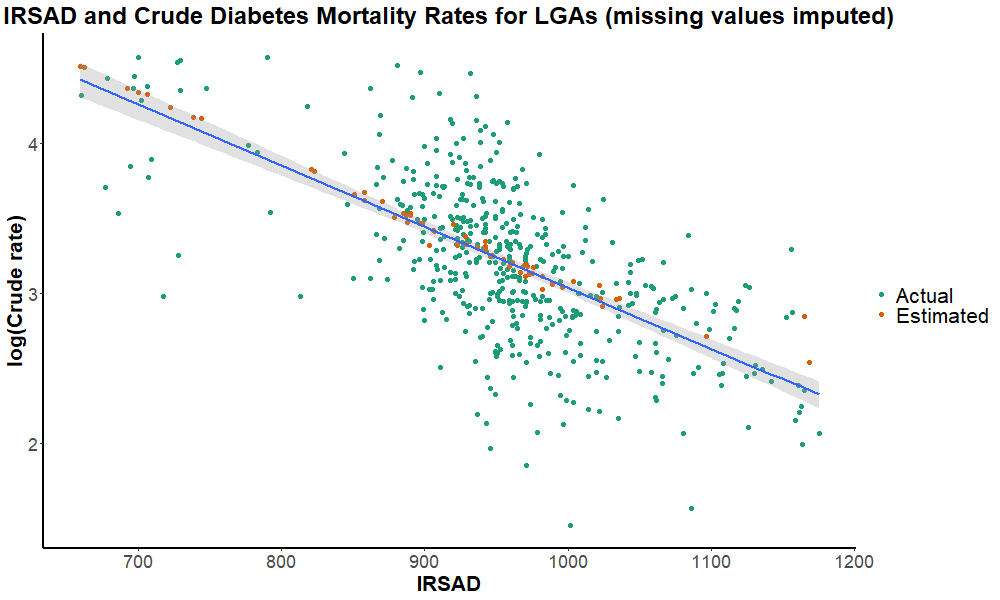

# **Word/figure count**
Words: 1900\
Figures: 7

# **Questions/Aims**
This project aims to use socioeconomic indexes to estimate crude diabetes death rates (CDDR). The relationship between socioeconomic status and diabetes is relatively well researched in Australia, however it mostly focuses on the prevalence of the disease and not mortality caused by it. This is as diabetes can cause other diseases such as coronary heart disease (CHD), stroke and other heart related complications (Suman et al., 2023), which are very common causes of death as demonstrated by Figure 1. Hence, we do not know the true CDDR, as the actual cause of death being, for example, CHD could have diabetes as the underlying cause.\
\

*Figure 1: CHD and stroke are very common causes of death, which can be caused by diabetes*\
\
While this analysis does not aim to estimate the true impact of diabetes on mortality, the CDDR is a good starting point. Research from Magliano et al. (2015) aimed to examine the relationship between distance from major urban areas, diabetes and cardiovascular mortality using data from the Australian national diabetes register, national deaths register and Accessibility/Remoteness Index of Australia. Interestingly, they found that the impact of diabetes was less in inner and outer regional areas, and more prevalent in major urban and remote areas (Magliano et al., 2015). A similar study performed by Morton et al. (2022) examined readmissions and mortality after a stroke, by diabetes status, sex and socioeconomic disadvantage. They found that people with diabetes were more likely to be readmitted and 1-year mortality risk was higher for socioeconomically disadvantaged patients (Morton et al., 2022).\
\
While both studies show similar data to what is presented here, this analysis leans more into the relationship between diabetes mortality and socioeconomics. Furthermore, diabetes is a leading cause of death in a number of LGAs, as demonstrated in Figure 2. In addition, Figure 3 shows that the index of relative socioeconomic advantage and disadvantage (IRSAD) is most strongly correlated with diabetes in comparison to other causes of death.\
\

*Figure 2: CHD and diabetes are the leading causes of death in the majority of LGAs in Australia*\
\
{width=600px, height=400px}\
*Figure 3: IRSAD is most strongly correlated with diabetes, showing a moderately strong negative correlation*

# **Data Description**
This analysis uses the ‘*Socio-Economic Indexes for Areas (SEIFA), Australia*’ dataset published by the Australian Bureau of Statistics (ABS), which describes a range of different socioeconomic indexes for LGAs of Australia in 2021. The indexes include the Index of Relative Socioeconomic Advantage and Disadvantage (IRSAD), Index of Relative Socioeconomic Disadvantage (IRSD), Index of Education and Occupation (IEO) and Index of Economic Resources (IER). IRSAD is generally regarded as the most complete socioeconomic index and is hence used most often throughout this analysis.\
\
The ‘*Mortality Over Regions and Time (MORT) Books*’ dataset published by the Australian Institute of Health and Welfare (AIHW) describes the number of deaths for each LGA in 2017-2021. This analysis uses the crude death rates per 100,000 people, with a specific focus on crude death rates for diabetes. More recent data was available, however as the ABS data was for 2021 it would not be applicable to use more recent data.\
\
Additionally, a shapefile of Australian LGAs was also downloaded to produce map visualisations of the data.

# **Raw data**
The SEIFA data can be downloaded from the ABS website [here.](https://www.abs.gov.au/statistics/people/people-and-communities/socio-economic-indexes-areas-seifa-australia/2021/Local%20Government%20Area%2C%20Indexes%2C%20SEIFA%202021.xlsx)\
The MORT books can be downloaded from the AIHW website [here.](https://www.aihw.gov.au/getmedia/a96b853b-e8c5-4cc0-baec-6da16b161099/AIHW-PHE-229-MORT_LGA_2017-2021.xlsx)\
The shapefile of LGAs can be downloaded from the ABS website [here.](https://www.abs.gov.au/statistics/standards/australian-statistical-geography-standard-asgs-edition-3/jul2021-jun2026/access-and-downloads/digital-boundary-files/LGA_2021_AUST_GDA2020_SHP.zip)\
The data was loaded into RStudio using the below code:
```{r results=F, message=F, warning=F, fig.show='hide'}
library(readxl)
library(sf)

mortality_raw <- read_xlsx("raw_data/AIHW-MORT_LGA_2017-2021.xlsx", 
                           sheet = "Table 2")
seifa_raw <- read_xlsx("raw_data/Local Government Area, Indexes, SEIFA 2021.xlsx", 
                       sheet = "Table 1")
lga_sf <- read_sf("raw_data/LGA_2021_AUST_GDA2020.shp")
```


# **Sanity checks**
A number of different dataframes were developed for this analysis. In the interest of brevity, we shall not describe in detail how these were produced, however the code required to produce these dataframes can be found [here.](https://github.com/tobybh1/MORT_SEIFA_Analysis/blob/main/source.R)\
The cleaned dataframes used to produce all figures in this report can be found  [here.](https://github.com/tobybh1/MORT_SEIFA_Analysis/tree/main/processed_data)\
\
`seifa_df` is a dataframe which is simply the cleaned output of the raw SEIFA data. A key task of the data cleaning process involved converting the indexes to numeric values, as R originally recognised the data as text.
```{r, message=F, warning=F}
library(skimr)
library(tidyverse)

seifa_df <- read_csv("processed_data/seifa_df.csv")
skim(seifa_df)
```
As the histograms demonstrate, there is some skewness in the data. We address this later when applying a regression model.\
\
`mortality_df` is the cleaned output of the original mortality data. Similarly, data cleaning also involved ensuring numbers were recognised as such by R, as well as shortening names of diseases to improve readability.
```{r, message=F, warning=F}
mortality_df <- read_csv("processed_data/mortality_df.csv")
skim(mortality_df)
```
Of note is the large number of missing values for numeric variables. This is as data can be suppressed for a number of reasons, such as crude rates being suppressed if the population of the LGA is less than 100, or age-standardised rates being suppressed if there are less than 20 total deaths in an area. This means that for many LGAs we do not have any mortality data, which is what the regression model described later attempts to address. The histograms show that numeric variables are all right skewed, which makes them unsuitable for linear regression. Additionally, there are two more LGAs in this dataframe compared to the SEIFA dataframe, however this as the mortality data contains summary statistics for the whole of Australia.

# **Addressing the questions/aims**
### **Why study the correlation between diabetes and IRSAD?**
We have already shown previously that IRSAD is most strongly correlated with diabetes, when compared to other causes of death. To further demonstrate this relationship, Figure 4 shows the IRSAD of each LGA and Crude death rate (per 100,000 people) of diabetes for each LGA.\
{width=700px, height=420px} 
{width=700px, height=420px}\
*Figure 4: In the IRSAD map, a lighter colour represents a lower socioeconomic status, whereas in the CDDR map, a lighter colour represents a higher death rate.*\
\
This also visually illustrates the impact of missing death rates data. While there is data for 88% of LGAs, the map shows that the missing data is mostly in large, remote LGAs, highlighting the need for prediction of death rates.

### **Estimating the missing data**
For 65 Australian LGAs, we have no data on the number of deaths caused by diabetes in 2017-2021, however we do have their socioeconomic indexes. Therefore we can develop a multiple linear regression model to predict the CDDR. Firstly, we note that a number of variables used for the regression model are skewed which violates the normality assumption of multiple linear regression, so we apply various logarithmic transformations to the dataframe to reduce the skewness of the data:
```{r, message=F, warning=F}
diab_seifa_df <- read_csv("processed_data/diab_seifa_df.csv")
diab_seifa_df$log_IRSD <- log(max(diab_seifa_df$IRSD+10) - diab_seifa_df$IRSD)
diab_seifa_df$log_IER <- log(max(diab_seifa_df$IER+10) - diab_seifa_df$IER)
diab_seifa_df$log_IEO <- log(diab_seifa_df$IEO)
diab_seifa_df$log_Crude_rate <- log(diab_seifa_df$Crude_rate)
```
Then we use `olsrr::ols_step_all_possible` to find the optimal model:
```{r, message=F, warning=F}
library(olsrr)

full_lm <- lm(data = diab_seifa_df, log_Crude_rate ~ IRSAD + log_IER + log_IEO + log_IRSD)
subs <- ols_step_all_possible(full_lm)
subs
```
As we can see above, the model containing IRSAD, log_IER and log_IRSD has the highest adjusted R-squared and a good Mallow's Cp value, meaning it is the most optimal regression model for this scenario. This optimal model accounts for roughly 40.8% of the variation in log(Crude rate). We can see this below in Figure 5 when looking at IRSAD vs log(Crude rate), as the above output also shows us that IRSAD is the best individual predictor.\
 
*Figure 5: There is a moderately strong correlation between IRSAD and log(Crude rate)*\
\
We can now impute missing values. Using IRSAD, log_IER and log_IRSD, we can input these values for each LGA into our regression model to find an estimated log(Crude rate), then apply an exponential transformation to get back to the actual value. This can be seen below in Figure 6:

*Figure 6: The estimated values fall mostly along the regression line as expected, and appear to not be outliers amongst the rest of the data.*\
\
Finally, we can also visually represent the crude rates in the map form again too:

*Figure 7: the map looks much better with no missing values! The estimated values appear to make sense when compared to actual crude death rates of nearby LGAs too.*

### **Critiques & Further Recommendations**
The key focus of this analysis was using socioeconomic indexes to estimate crude diabetes death rates, which we have shown to largely be successful. Furthermore, we highlighted the strength of the correlation between these two variables, as the predicted values appear to be similar to actual values. However, a multiple linear regression model may not have been suitable for this dataset. This is demonstrated by Figure 6, which appears almost curvilinear for IRSAD values above 850, with a diminishing returns relationship present. By creating a curvilinear regression model for LGAs with an IRSAD above 850, estimation accuracy could have improved, however the variance would still be high. As an example, consider 2 neighbouring LGAs in the North-Western corner of Queensland: Bourke and Mt Isa. Their indexes are very similar, yet the estimated CDDR of Bourke is 41.75 per 100,000 and the actual CDDR of Mt Isa is 31.01 per 100,000. While we do not know the true CDDR of Bourke, this is an abnormally large difference between two socioeconomically, geographically and demographically similar LGAs. Instead, a machine learning model trained on both current and archived data could potentially more accurately estimate CDDR.\
\
Furthermore, socioeconomic data is not the only factor for CDDR - diet, exercise, healthcare access and others all play a significant role. However, restricting ourselves to the scope of the study, an “area factor” could be created, with the estimation using socioeconomic indexes as well as accounting for the death rates of neighbouring LGAs. This relies on the assumption that neighbouring LGAs would have people with similar lifestyle habits and access to healthcare, meaning they would have similar death rates.

### **Conclusion**
This analysis uses SEIFA data and the MORT books to demonstrate a moderate correlation between crude diabetes death rates and socioeconomic status, which was found to be the strongest out of the top 10 causes of death in Australia. Furthermore, a number of LGAs with missing deaths data were able to be predicted with some degree of accuracy. While there were aspects of this analysis that could be improved upon, it represents the capability of these two datasets for high-level and relevant discoveries of association between mortality and socioeconomic status.

# **References**
Magliano, DJ, Cohen, K, Harding, JL & Shaw, JE 2015, ‘Residential distance from major urban areas, diabetes and cardiovascular mortality in Australia’, *Diabetes Research and Clinical Practice*, vol. 109, no. 2, pp. 271–278.

Morton, JI, Ilomäki, J, Wood, SJ, Bell, JS, Shaw, JE & Magliano, DJ 2022, ‘One-year readmission and mortality following ischaemic stroke by diabetes status, sex, and socioeconomic disadvantage: An analysis of 27,802 strokes from 2012 to 2017’, *Journal of the Neurological Sciences*, vol. 434, p. 120149.

Suman, S, Biswas, A, Kohaf, N, Singh, C, Johns, R, Jakkula, P & Hastings, N 2023, ‘The Diabetes-Heart Disease Connection: Recent Discoveries and Implications’, *Current Problems in Cardiology*, vol. 48, no. 11, p. 101923.